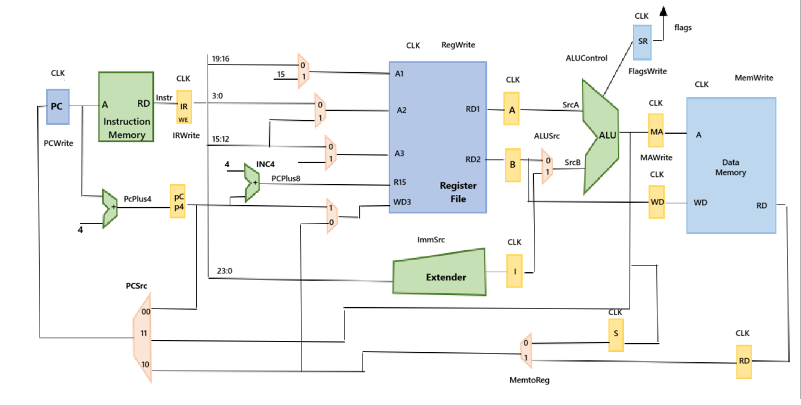
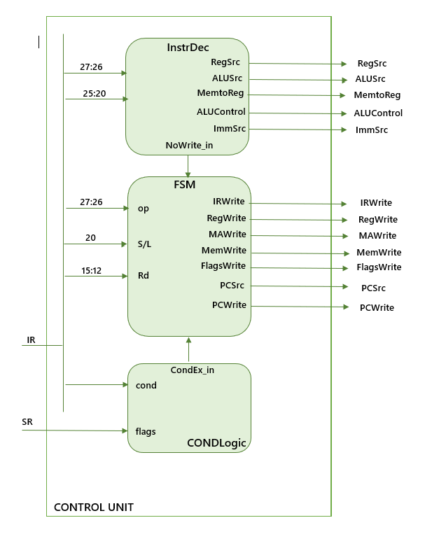
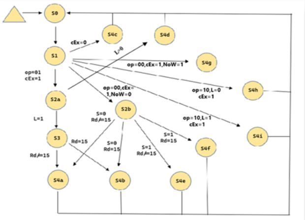
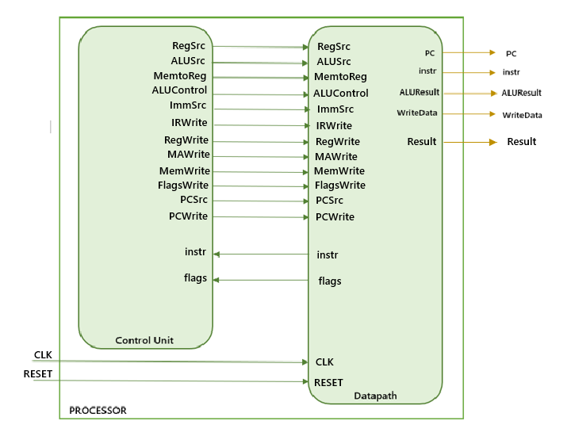

# Multicycle ARM Processor - VHDL Implementation  

## 📌 Project Description  
This project implements a multicycle ARM processor in VHDL using Vivado IDE.  
The processor supports various ARM instruction types, including data processing, memory, and branch instructions.  
It follows a multicycle execution model to optimize resource usage while maintaining instruction flexibility.  

## 🔹 Supported Instructions  

### 🏗 Data Processing  
- `ADD(S)`  
- `SUB(S)`  
- `AND(S)`  
- `ORR(S)`  
- `XOR(S)`  
- `CMP`  
- `MOV`, `MVN`  
- `LSL`, `LSR`, `ASR`  
- `ROR`  

### 📦 Memory  
- `LDR`  
- `STR`  

### 🔀 Branch  
- `B`  
- `BL`  

## 🔹 Design Process

### 1️⃣ Datapath
The datapath is responsible for the processing and flow of data within the system.  

To construct the Datapath, the following components were initially designed: Program Counter (PC), Instruction Memory, Adder, 2-to-1 Multiplexer, 3-to-1 Multiplexer, Register File, Extender, ALU, Status Register, Data Memory, and various Registers with different functionalities, including Registers with Reset and Write Enable (WE) signals and Registers with only Reset functionality. These fundamental modules were then interconnected to form the complete Datapath of the Multicycle ARM Processor, ensuring efficient data flow and execution of instructions.

<p align="center">
  
</p>

### 2️⃣ Control Unit
The control unit in a processor is responsible for coordinating and controlling the execution of a program's instructions. Specifically, it receives instructions from memory, decodes them into control signals, and then coordinates the transfer of data to the datapath.

<p align="center">
  
</p>  
  
    
### 3️⃣ Finite State Machine (FSM)  
The FSM is a key part of the Control Unit, managing the execution cycles of each instruction.  
It determines the sequence of control signals required to execute each operation correctly.  

<p align="center">
  
</p>  

### 4️⃣ **Processor Integration**
At this stage, the Datapath and the Control Unit are combined to form the complete processor.  
The instruction memory is loaded with ARM machine code, and the processor executes instructions in multiple cycles.

<p align="center">
  
</p>  

  


## 🔹 Simulation & Testing  
To verify the functionality of the ARM multicycle processor, we tested it with an assembly program,  
which was loaded into the Instruction Memory in hexadecimal format.  

### 📜 Test Program  
The following ARM assembly program was used and performs arithmetic operations, logical operations, branching, and memory access.  

```assembly
main:
mov r0,#1
mov r1,#2
mov r3,r1
mov r4,#5
add r5,r0,r1
sub r6,r4,r0
and r7,r5,r4
orr r8,r5,#5
eor r9,r4,#3
cmp r1,r3
moveq r1,#15
mvn r10,r1
lsl r11,r10,#1
ror r12,r11,#2
adds r6,r8,r9
subs r13,r0,r1
cmp r13,r5
beq function_1
add r1,r0,r0
b function_1
add r1,r1,r0

function_1:
mov r9,#-5
add r8,r9,#2
cmp r9,#0
subne r9,r3,#2
str r3,[r1,#0]
ldr r0,[r1,#0]
bl main
```

## 🔹 Conclusion

This project successfully implements a multicycle ARM processor in VHDL,supporting a variety of instructions.

The disegn was tested in VIVADO IDE using an ARM assembly program loaded in hexademical format into the isntruction memory.
The results confirmed that:
- The datapath and control unit work correctly.  
- The processor executes instructions in multiple cycles as expected.  
- Branching and memory operations behave correctly during execution.  

The implementation provides a flexible and modular design, making it a strong foundation for further enhancements.